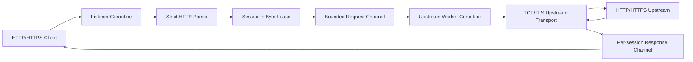

# Async Proxy

[English](#english) | [한국어](#한국어)

## English

Resource-bounded HTTP/HTTPS reverse proxy for Embedded Linux, written in C++20.

`async_proxy` is a lightweight HTTP/1.1 reverse proxy built with standalone Asio coroutines and OpenSSL. Its main purpose is to demonstrate how an embedded network service can place explicit limits on sessions, queued work, and buffered bytes while handling slow clients, slow upstreams, and TLS connections.

This repository does not publish code from a specific product or business domain. It independently reconstructs general networking techniques learned while designing embedded relay services.

> The current version is `0.1.0`. It is intended for study and portfolio review. Read [Current limitations](#current-limitations) before considering production use.

### Design goals

- Use a fixed number of I/O threads and coroutine workers.
- Apply explicit limits to sessions, queued jobs, and buffered message bytes.
- Serve HTTP and HTTPS listeners at the same time.
- Forward requests to either an HTTP or HTTPS upstream.
- Prevent slow or unavailable peers from occupying the whole relay pipeline.
- Reject ambiguous HTTP framing before forwarding a request.
- Keep application policy separate from listener, queue, and transport ownership.
- Provide a predictable SIGINT/SIGTERM shutdown path.

### Highlights

| Area | Implementation |
|---|---|
| Asynchronous I/O | C++20 coroutines, standalone Asio, bounded concurrent channel |
| Listeners | HTTP and HTTPS, retry after transient `accept()` errors |
| Upstream | HTTP/HTTPS, DNS resolution, SNI, certificate and hostname verification |
| Resource limits | Session cap, request queue capacity, global in-flight byte budget |
| HTTP framing | Content-Length, chunked, and close-delimited responses |
| Validation | Duplicate length, CL+TE, invalid line endings, and incomplete EOF rejection |
| Timeouts | TLS handshake, request read, upstream operation, and response wait |
| TLS memory | Reused SSL contexts and a bounded downstream session cache |
| Extension points | Request preflight, request/response transforms, and logging callback |
| Tests | HTTP parser unit test and plain HTTP/TLS integration test |

### Architecture



Each accepted connection acquires a session slot. As request and response data is buffered, the session grows a lease against a process-wide byte budget. A completed request is placed in a bounded channel and consumed by one of the upstream workers. The result returns through a per-session response channel, and the lease is released after both the client session and queued job release it.

### Default resource limits

| Setting | Default | Purpose |
|---|---:|---|
| `io_thread_count` | 2 | Threads running the Asio `io_context` |
| `worker_count` | 2 | Concurrent upstream worker coroutines |
| `queue_capacity` | 1,024 | Maximum queued request jobs |
| `max_sessions` | 128 | Maximum concurrent downstream sessions |
| `max_inflight_bytes` | 32 MiB | Process-wide request/response buffer budget |
| `max_request_size` | 4 MiB | Maximum request size |
| `max_response_size` | 4 MiB | Maximum response size |
| `max_header_size` | 64 KiB | Maximum HTTP header section |
| `handshake_timeout` | 5 s | Downstream TLS handshake deadline |
| `request_timeout` | 10 s | Downstream request read deadline |
| `upstream_timeout` | 10 s | Resolve-to-response upstream deadline |
| `response_timeout` | 15 s | Wait for a queued job's response |

The defaults are demonstration values. Tune them for the target device and workload.

#### Overload behavior

- Session limit reached: close the new connection.
- Request queue full: return `503 Service Unavailable`.
- In-flight byte budget exhausted: return `503 Service Unavailable`.
- Request too large: return `413 Payload Too Large`.
- Upstream connection or protocol error: return `502 Bad Gateway`.
- Upstream or response wait timeout: return `504 Gateway Timeout`.

The byte budget covers request and response buffers on the normal upstream path. Custom hooks are trusted code and must not block an I/O thread or create data beyond the configured limits.

### HTTP scope and security boundaries

The proxy handles one HTTP/1.0 or HTTP/1.1 request per downstream connection. It sends `Connection: close` upstream. Chunked request bodies are decoded and forwarded with a generated `Content-Length`.

The parser rejects:

- duplicate `Content-Length` or `Transfer-Encoding` fields;
- a request containing both `Content-Length` and `Transfer-Encoding`;
- negative, non-numeric, or overflowing lengths;
- bare LF and malformed CRLF line endings;
- missing or duplicate `Host` fields in HTTP/1.1;
- folded or malformed header fields;
- a body without framing;
- incomplete messages at EOF;
- pipelined requests, protocol upgrades, and the HTTP/2 connection preface.

`Host` is regenerated for the configured upstream. Standard hop-by-hop fields and fields named by `Connection` are removed before forwarding.

### TLS behavior

Downstream TLS:

- loads a certificate chain and PEM private key;
- reuses one OpenSSL server context;
- limits the server session cache to 64 entries with a 60-second timeout;
- enables `SSL_MODE_RELEASE_BUFFERS`;
- applies handshake and shutdown timeouts.

Upstream TLS:

- sends SNI;
- verifies the certificate chain and hostname by default;
- uses the system trust store or an additional CA file;
- supports `--upstream-insecure` only for isolated development environments.

### Extension hooks

`ProxyHandlers` allows application policy to be added without changing listener and queue ownership.

```cpp
ProxyHandlers handlers;

handlers.request_preflight = [](ProxyRequest& request)
    -> asio::awaitable<std::optional<ProxyResponse>> {
    if (request.http.target == "/health") {
        co_return ProxyResponse{
            "HTTP/1.1 204 No Content\r\n"
            "Content-Length: 0\r\n"
            "Connection: close\r\n\r\n"
        };
    }
    co_return std::nullopt;
};

handlers.request_transform = [](ProxyRequest& request) {
    request.http.headers.push_back({"X-Proxy", "async-proxy"});
};
```

| Hook | Purpose |
|---|---|
| `request_preflight` | Return a local response or perform an asynchronous check |
| `request_transform` | Modify request headers or body |
| `response_transform` | Modify the downstream response |
| `log` | Connect an application logger |

Hooks run on I/O threads. Move long synchronous work to a separate executor, and make coroutine hooks respect cancellation and deadlines.

### Requirements

- CMake 3.20 or later
- C++20 compiler
- standalone Asio
- OpenSSL
- pthreads/Threads

The integration test additionally requires Bash, curl, Python 3, and the OpenSSL command-line tool.

### Build

Point `ASIO_INCLUDE_DIR` at the directory containing `asio.hpp`:

```bash
cmake -S . -B build \
  -DASIO_INCLUDE_DIR=/path/to/asio/include \
  -DCMAKE_BUILD_TYPE=Release
cmake --build build -j
```

Alternatively, place standalone Asio at:

```text
third_party/asio/include/asio.hpp
```

Then configure without the explicit include path:

```bash
cmake -S . -B build -DCMAKE_BUILD_TYPE=Release
cmake --build build -j
```

### Test

Run the unit test:

```bash
ctest --test-dir build --output-on-failure
```

Run the loopback HTTP and TLS integration test:

```bash
bash ./tests/integration_test.sh ./build
```

The integration script generates temporary servers and certificates, validates HTTP-to-HTTP and HTTPS-to-HTTPS relay paths, and removes its generated files on exit.

### Run

Plain HTTP listener and upstream:

```bash
./build/async_proxy \
  --listen 0.0.0.0 \
  --http-port 8080 \
  --upstream-host 127.0.0.1 \
  --upstream-port 9000
```

HTTPS listener and upstream:

```bash
./build/async_proxy \
  --http-port 0 \
  --https-port 8443 \
  --cert ./server.crt \
  --key ./server.key \
  --upstream-host api.example.test \
  --upstream-port 443 \
  --upstream-tls \
  --upstream-ca ./ca.crt
```

Use `./build/async_proxy --help` for the complete option list.

### Project layout

```text
.
├── CMakeLists.txt
├── include/async_proxy/
│   ├── http.h
│   └── proxy_system.h
├── src/
│   ├── http.cpp
│   ├── main.cpp
│   └── proxy_system.cpp
└── tests/
    ├── http_test.cpp
    └── integration_test.sh
```

### Current limitations

- No HTTP/2, WebSocket upgrade, or CONNECT tunneling.
- No HTTP pipelining or downstream keep-alive.
- No upstream connection pooling; every request creates a new connection.
- Normal request and response messages are limited to 4 MiB; body streaming is not implemented.
- A response timeout stops the downstream wait but does not yet cancel a queued job.
- Downstream response writes do not yet have a separate timeout.
- Restarting the same `ProxySystem` instance after `stop()` is outside the supported lifecycle.
- Custom hook output is not independently checked against a final size limit.

### Roadmap

- Propagate job deadlines and cancellation state to workers.
- Add a downstream response write timeout.
- Cancel acceptors, active sessions, and queued jobs during `stop()`.
- Make dependency setup work immediately after cloning.
- Add GitHub Actions for Linux builds and tests.
- Add overload, timeout, and TLS verification failure integration tests.
- Publish reproducible latency, RSS, and file-descriptor measurements.
- Add lightweight runtime metrics.

Performance numbers will only be published together with reproducible commands and test environment details.

### License

No open-source license has been applied yet. Until a `LICENSE` file is added, viewing the source does not grant permission to copy, modify, or redistribute it. Third-party components remain subject to their respective licenses.

---

## 한국어

제한된 임베디드 Linux 환경을 위한 C++20 기반 HTTP/HTTPS reverse proxy.

`async_proxy`는 standalone Asio coroutine과 OpenSSL을 사용해 구현한 경량 HTTP/1.1 reverse proxy다. 느린 클라이언트와 upstream, TLS 연결 비용, 무제한 세션 및 메시지 버퍼로 인해 임베디드 장치의 자원이 고갈되는 문제를 명시적인 제한과 backpressure로 다루는 데 초점을 맞췄다.

이 저장소는 특정 제품이나 업무 도메인의 코드를 공개하기 위한 것이 아니다. 임베디드 네트워크 릴레이를 설계하며 다룬 일반적인 문제를 독립적으로 실행하고 검증할 수 있는 예제로 재구성했다.

> 현재 버전은 `0.1.0`이다. 학습과 포트폴리오 검토를 위한 프로젝트이며, 아래의 [현재 제한 사항](#현재-제한-사항)을 확인하지 않은 상태로 운영 환경에 배포하는 것은 권장하지 않는다.

## 설계 목표

- 고정된 수의 I/O thread와 coroutine worker 사용
- queue, session 및 메모리 사용량에 명시적인 상한 적용
- HTTP와 HTTPS listener 동시 제공
- HTTP 또는 HTTPS upstream 지원
- 느리거나 연결되지 않은 peer가 전체 relay pipeline을 점유하지 않도록 timeout 적용
- gateway와 upstream의 HTTP 메시지 경계 해석 차이 방지
- 인증, 라우팅, 로깅 같은 애플리케이션 정책과 네트워크 수명주기 분리
- SIGINT와 SIGTERM을 통한 예측 가능한 프로세스 종료

## 주요 기능

| 영역 | 구현 내용 |
|---|---|
| 비동기 I/O | C++20 coroutine, standalone Asio, bounded concurrent channel |
| Listener | HTTP 및 HTTPS listener, 일시적인 `accept()` 오류 재시도 |
| Upstream | HTTP/HTTPS, DNS resolve, SNI, 인증서 및 hostname 검증 |
| 자원 제한 | 최대 session 수, request queue 크기, 전체 in-flight byte 예산 |
| HTTP framing | `Content-Length`, chunked, close-delimited response 처리 |
| 보안 검사 | 중복 길이, CL+TE, 잘못된 line ending, 불완전한 EOF 거부 |
| Timeout | TLS handshake, request read, upstream 전체 작업, response wait |
| TLS 메모리 | SSL context 재사용, downstream session cache 크기 및 수명 제한 |
| 확장 | request preflight, request transform, response transform, log callback |
| 검증 | HTTP parser 단위 테스트, plain HTTP 및 TLS 통합 테스트 |

## 아키텍처


### 요청 처리 순서

1. HTTP 또는 HTTPS listener가 클라이언트 연결을 수락한다.
2. session 한도 안에서 연결을 확보하고 process-wide byte lease를 생성한다.
3. strict parser가 HTTP request line, header 및 body framing을 검증한다.
4. 완성된 요청을 bounded request channel에 넣는다.
5. worker가 선택적 preflight와 transform을 실행한 뒤 upstream으로 전송한다.
6. upstream 응답을 framing 규칙과 크기 제한에 따라 읽는다.
7. per-session response channel을 통해 원래 클라이언트 coroutine으로 응답을 돌려보낸다.
8. session이 종료되고 queue job의 참조가 모두 해제되면 byte lease를 반환한다.

## 기본 자원 제한

기본값은 기능 시연을 위한 보수적인 설정이며, 실제 장치에서는 메모리와 트래픽 특성에 맞춰 조정해야 한다.

| 설정 | 기본값 | 의미 |
|---|---:|---|
| `io_thread_count` | 2 | `io_context` 실행 thread 수 |
| `worker_count` | 2 | 동시에 upstream 작업을 수행하는 coroutine 수 |
| `queue_capacity` | 1,024 | 대기 가능한 request job 수 |
| `max_sessions` | 128 | 동시에 유지할 수 있는 downstream session 수 |
| `max_inflight_bytes` | 32 MiB | request/response 데이터에 대한 process-wide 예산 |
| `max_request_size` | 4 MiB | 단일 request 최대 크기 |
| `max_response_size` | 4 MiB | 단일 response 최대 크기 |
| `max_header_size` | 64 KiB | 단일 HTTP header 영역 최대 크기 |
| `handshake_timeout` | 5초 | downstream TLS handshake 제한 |
| `request_timeout` | 10초 | downstream request 수신 제한 |
| `upstream_timeout` | 10초 | resolve부터 response 수신까지의 제한 |
| `response_timeout` | 15초 | queue 제출 후 downstream 응답 대기 제한 |

### 과부하 동작

- session 한도 초과: 새 연결을 닫는다.
- request queue 포화: `503 Service Unavailable`을 반환한다.
- in-flight byte 예산 초과: `503 Service Unavailable`을 반환한다.
- 단일 메시지 크기 초과: `413 Payload Too Large`를 반환한다.
- upstream 연결 또는 프로토콜 오류: `502 Bad Gateway`를 반환한다.
- upstream 또는 response 대기 timeout: `504 Gateway Timeout`을 반환한다.

메모리 예산은 기본 upstream 전송 경로의 request/response buffer를 대상으로 한다. 사용자 정의 hook은 신뢰된 코드로 간주하며, 장시간 block하거나 설정된 크기 제한을 초과하는 데이터를 생성하지 않아야 한다.

## HTTP 처리 범위

이 프로젝트는 연결 하나에서 HTTP/1.0 또는 HTTP/1.1 요청 하나를 처리한다. upstream 요청에는 `Connection: close`를 적용하고, chunked request body는 decode한 뒤 계산된 `Content-Length`로 전달한다.

### 거부하는 입력

- 중복 `Content-Length`
- 중복 `Transfer-Encoding`
- `Content-Length`와 `Transfer-Encoding` 동시 사용
- 음수, 비숫자 또는 overflow가 발생한 `Content-Length`
- bare LF 또는 잘못된 CRLF
- HTTP/1.1 요청의 누락되거나 중복된 `Host`
- folded header와 잘못된 header name/value
- body framing 없이 전달된 request body
- 완성되지 않은 request 또는 response의 EOF
- HTTP pipelining, protocol upgrade 및 HTTP/2 preface

### Header 전달 규칙

`Host`는 upstream 주소로 다시 생성한다. 다음 hop-by-hop header와 `Connection`에서 지목한 header는 upstream에 전달하지 않는다.

- `Connection`
- `Proxy-Connection`
- `Keep-Alive`
- `Transfer-Encoding`
- `TE`
- `Trailer`
- `Upgrade`
- 기존 `Content-Length`

## TLS

### Downstream TLS

- certificate chain과 PEM private key 사용
- OpenSSL server context 재사용
- TLS session cache 최대 64개, timeout 60초
- `SSL_MODE_RELEASE_BUFFERS` 적용
- handshake와 shutdown timeout 적용

### Upstream TLS

- SNI 설정
- 기본적으로 certificate chain과 hostname 검증
- 시스템 trust store 또는 별도 CA 파일 사용
- `--upstream-insecure`는 격리된 개발 환경에서만 사용

## 확장 Hook

`ProxyHandlers`를 사용하면 listener와 queue 소유권을 변경하지 않고 애플리케이션 정책을 추가할 수 있다.

```cpp
ProxyHandlers handlers;

handlers.request_preflight = [](ProxyRequest& request)
    -> asio::awaitable<std::optional<ProxyResponse>> {
    if (request.http.target == "/health") {
        co_return ProxyResponse{
            "HTTP/1.1 204 No Content\r\n"
            "Content-Length: 0\r\n"
            "Connection: close\r\n\r\n"
        };
    }
    co_return std::nullopt;
};

handlers.request_transform = [](ProxyRequest& request) {
    request.http.headers.push_back({"X-Proxy", "async-proxy"});
};
```

제공되는 hook은 다음과 같다.

| Hook | 용도 |
|---|---|
| `request_preflight` | upstream 전송 전 자체 응답 또는 비동기 검사 |
| `request_transform` | request header와 body 변경 |
| `response_transform` | downstream으로 보낼 response 변경 |
| `log` | 애플리케이션 로거 연결 |

Hook은 I/O thread에서 호출된다. 동기식 장시간 작업은 별도 executor로 넘겨야 하며, coroutine hook은 취소와 deadline을 고려해야 한다.

## 요구 사항

- CMake 3.20 이상
- C++20 지원 컴파일러
- standalone Asio
- OpenSSL
- pthreads/Threads

통합 테스트에는 `bash`, `curl`, `python3`, OpenSSL command-line tool이 추가로 필요하다.

## 빌드

### 설치된 Asio 사용

`asio.hpp`가 포함된 디렉터리를 지정한다.

```bash
cmake -S . -B build \
  -DASIO_INCLUDE_DIR=/path/to/asio/include \
  -DCMAKE_BUILD_TYPE=Release
cmake --build build -j
```

### 저장소 내부에 Asio 배치

standalone Asio를 다음 경로에 배치하면 별도 옵션 없이 탐색한다.

```text
third_party/asio/include/asio.hpp
```

```bash
cmake -S . -B build -DCMAKE_BUILD_TYPE=Release
cmake --build build -j
```

## 테스트

### 단위 테스트

```bash
ctest --test-dir build --output-on-failure
```

현재 단위 테스트는 다음 항목을 확인한다.

- 정상 `Content-Length` 요청과 upstream 재직렬화
- 중복 Content-Length 및 CL+TE 거부
- 음수 Content-Length와 bare LF 거부
- chunked request decode 및 trailer 처리
- HTTP/2 preface 거부
- fixed-length, chunked 및 close-delimited response 판정
- 잘린 response와 중복 Content-Length 거부

### 통합 테스트

```bash
bash ./tests/integration_test.sh ./build
```

통합 테스트는 임시 loopback server와 인증서를 생성해 다음 경로를 검증한다.

- HTTP client → HTTP listener → HTTP upstream
- HTTPS client → HTTPS listener → HTTPS upstream

생성한 인증서, 로그 및 임시 파일은 테스트 종료 시 삭제한다.

## 실행

### HTTP listener와 HTTP upstream

```bash
./build/async_proxy \
  --listen 0.0.0.0 \
  --http-port 8080 \
  --upstream-host 127.0.0.1 \
  --upstream-port 9000
```

### HTTPS listener와 HTTPS upstream

```bash
./build/async_proxy \
  --http-port 0 \
  --https-port 8443 \
  --cert ./server.crt \
  --key ./server.key \
  --upstream-host api.example.test \
  --upstream-port 443 \
  --upstream-tls \
  --upstream-ca ./ca.crt
```

### 주요 CLI 옵션

| 옵션 | 설명 |
|---|---|
| `--listen ADDRESS` | listener bind 주소 |
| `--http-port PORT` | HTTP port, `0`이면 비활성화 |
| `--https-port PORT` | HTTPS port, `0`이면 비활성화 |
| `--cert FILE` | HTTPS certificate chain |
| `--key FILE` | HTTPS PEM private key |
| `--upstream-host HOST` | upstream hostname 또는 IP |
| `--upstream-port PORT` | upstream TCP port |
| `--upstream-tls` | upstream TLS 활성화 |
| `--upstream-ca FILE` | 추가 CA 파일 |
| `--upstream-insecure` | upstream 인증서 검증 비활성화 |
| `--threads COUNT` | I/O thread 수 |
| `--workers COUNT` | upstream worker 수 |
| `--queue-capacity COUNT` | request queue 용량 |
| `--max-sessions COUNT` | 최대 동시 session 수 |
| `--max-inflight-bytes BYTES` | process-wide message byte 예산 |

전체 옵션은 다음 명령으로 확인할 수 있다.

```bash
./build/async_proxy --help
```

## 프로젝트 구조

```text
.
├── CMakeLists.txt
├── include/async_proxy/
│   ├── http.h
│   └── proxy_system.h
├── src/
│   ├── http.cpp
│   ├── main.cpp
│   └── proxy_system.cpp
└── tests/
    ├── http_test.cpp
    └── integration_test.sh
```

## 현재 제한 사항

- HTTP/2를 지원하지 않는다.
- WebSocket upgrade와 CONNECT tunneling을 지원하지 않는다.
- HTTP pipelining과 downstream keep-alive를 지원하지 않는다.
- upstream connection pooling을 사용하지 않고 요청마다 새 연결을 만든다.
- 일반 request/response는 최대 4 MiB이며 대용량 body streaming은 지원하지 않는다.
- response timeout은 downstream 대기를 종료하지만 이미 queue에 들어간 job을 취소하지 않는다.
- downstream response write에는 별도의 timeout이 아직 적용되지 않았다.
- 하나의 `ProxySystem` 객체에서 `stop()` 후 다시 `start()`하는 동작은 지원 범위가 아니다.
- 사용자 정의 hook이 생성한 데이터의 최종 크기 제한은 hook 작성자가 지켜야 한다.

## 향후 개선

- job deadline과 취소 상태를 worker까지 전파
- downstream response write timeout 추가
- `stop()` 시 acceptor와 활성 session을 취소하고 queue job을 완료 처리
- clone 직후 빌드할 수 있는 Asio dependency 구성
- GitHub Actions 기반 Linux build 및 test
- queue 포화, byte budget 고갈, timeout 및 TLS 검증 실패 통합 테스트
- 동시 접속 부하에서 latency, RSS 및 file descriptor 측정
- Prometheus 또는 경량 callback 기반 runtime metrics

성능 수치는 재현 가능한 환경과 명령을 함께 제공할 수 있을 때 추가한다.

## 라이선스

현재 저장소에는 오픈소스 라이선스가 적용되지 않았다. 별도의 `LICENSE`가 추가되기 전까지 소스 열람 외의 복제, 수정 및 재배포 권한은 부여되지 않는다.

사용한 third-party 라이브러리는 각 라이브러리의 라이선스를 따른다.
